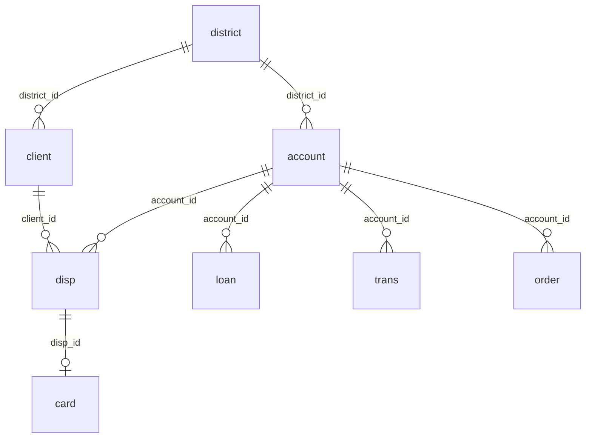

# Dicionário de Dados — financial (Berka / PKDD'99)

> Versão hospedada: **Financial (Jan Motl)** — `relational.fel.cvut.cz`  
> Gerado em: 2026-06-30  
> Total de linhas: ~1.090.086

## Diagrama ER (relacionamentos)

## Tabelas

### account (4.500 linhas)

| Coluna | Tipo | Chave | Descrição |
|---|---|---|---|
| account_id | int | PK | Identificador da conta |
| district_id | int | FK → district | Região da conta |
| frequency | varchar(18) | | Frequência de extrato |
| date | date | | Data de abertura |

### card (892 linhas)

| Coluna | Tipo | Chave | Descrição |
|---|---|---|---|
| card_id | int | PK | Identificador do cartão |
| disp_id | int | FK → disp | Disposição vinculada |
| type | varchar(7) | | junior / classic / gold |
| issued | date | | Data de emissão |

### client (5.369 linhas)

| Coluna | Tipo | Chave | Descrição |
|---|---|---|---|
| client_id | int | PK | Identificador do cliente |
| gender | varchar(1) | | M / F |
| birth_date | date | | Data de nascimento (já decodificada) |
| district_id | int | FK → district | Região do cliente |

### disp (5.369 linhas)

| Coluna | Tipo | Chave | Descrição |
|---|---|---|---|
| disp_id | int | PK | Identificador da disposição |
| client_id | int | FK → client | Cliente |
| account_id | int | FK → account | Conta |
| type | varchar(9) | | OWNER (4.500) / DISPONENT (869) |

### district (77 linhas)

| Coluna | Tipo | Descrição (PKDD) |
|---|---|---|
| district_id | int PK | Identificador |
| A2 | varchar | Nome do distrito |
| A3 | varchar | Região |
| A4 | int | Habitantes |
| A5–A9 | int | Métricas de municípios |
| A10 | decimal | Razão urbana |
| A11 | int | Salário médio |
| A12 | decimal | Desemprego 1995 (nullable) |
| A13 | decimal | Desemprego 1996 |
| A14 | int | Empreendedores por 1000 hab. |
| A15 | int | Crimes 1995 (nullable) |
| A16 | int | Crimes 1996 |

### loan (682 linhas)

| Coluna | Tipo | Chave | Descrição |
|---|---|---|---|
| loan_id | int | PK | Identificador do empréstimo |
| account_id | int | FK → account | Conta |
| date | date | | Data de concessão |
| amount | int | | Valor |
| duration | int | | Duração (meses) |
| payments | decimal | | Valor da parcela |
| status | varchar(1) | | A/B/C/D |

**Distribuição de status:** A=203, B=31, C=403, D=45

| Status | Significado | Grupo |
|---|---|---|
| A | Finalizado, sem problemas | bom |
| B | Finalizado, não pago | mau |
| C | Em andamento, em dia | bom |
| D | Em andamento, em débito | mau |

### order (6.471 linhas) — palavra reservada: usar crases `` `order` ``

| Coluna | Tipo | Chave |
|---|---|---|
| order_id | int | PK |
| account_id | int | FK → account |
| bank_to | varchar(2) | |
| account_to | int | |
| amount | decimal | |
| k_symbol | varchar(8) | |

### trans (1.056.320 linhas)

| Coluna | Tipo | Chave | Descrição |
|---|---|---|---|
| trans_id | int | PK | Identificador |
| account_id | int | FK → account | Conta |
| date | date | | Data da transação |
| type | varchar(6) | | PRIJEM / VYDAJ |
| operation | varchar(14) | nullable | Tipo de operação |
| amount | int | | Valor |
| balance | int | | Saldo após transação |
| k_symbol | varchar(11) | nullable | Categoria |
| bank | varchar(2) | nullable | |
| account | int unsigned | nullable | Conta destino |

**Período:** trans 1993-01-01 a 1998-12-31 | loan 1993-07-05 a 1998-12-08

## Impacto no star schema

| Decisão | Motivo |
|---|---|
| `district_id` em `fact_loan` via JOIN `account` | `loan` não possui `district_id` nativo |
| Aliases amigáveis em `dim_district` | Colunas A2–A16 no schema real |
| `idade_cliente` de `birth_date` | Versão Motl já separa gênero e nascimento |
| `fact_trans` com 1M+ linhas | Import Power BI em modo Import; considerar agregações para performance |
| `` `order` `` com crases | Palavra reservada SQL |

## Cardinalidades validadas

- 1 conta → 1 OWNER em `disp` (4.500 OWNERs)
- 682 empréstimos para subset de 4.500 contas
- 892 cartões via `disp` → `card`
