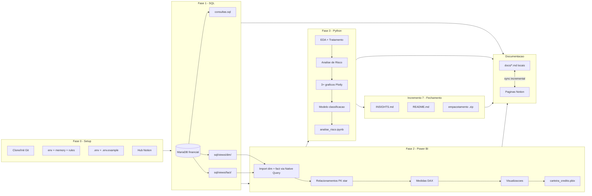
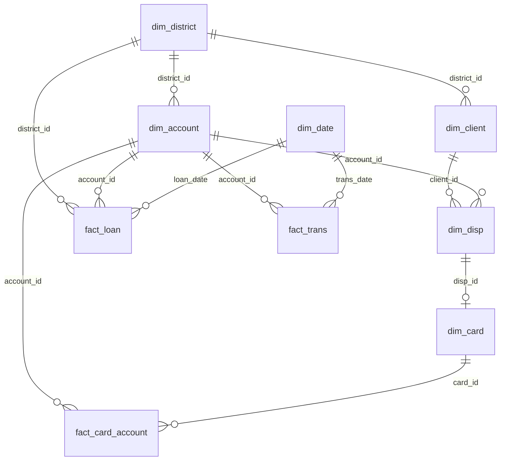

# Plano: Desafio Técnico MYDE — Analista de Dados

## Contextos

O desafio (`[reef/candidato_teste_tecnico_analista_de_dados.pdf](reef/candidato_teste_tecnico_analista_de_dados.pdf)`) é um take-home sobre o dataset **Berka/PKDD'99** (banco tcheco), com três partes obrigatórias + bônus Python. O banco está hospedado em MariaDB público (somente leitura):


| Campo    | Valor                    |
| -------- | ------------------------ |
| Host     | `relational.fel.cvut.cz` |
| Porta    | `3306`                   |
| Database | `financial`              |
| Usuário  | `guest`                  |
| Senha    | `ctu-relational`         |


**8 tabelas:** `client`, `account`, `disp`, `trans`, `loan`, `card`, `order`, `district`

**Legenda de risco (`loan.status`):** A/C = bom · B/D = mau (inadimplente)

**Repositório alvo:** [github.com/lucasagon/myde-desafio-tecnico-analista-de-dados-lucas-a-goncalves](https://github.com/lucasagon/myde-desafio-tecnico-analista-de-dados-lucas-a-goncalves) — branch `main`

**Estado atual do workspace local** (`[D:\_Projects\myde](D:\_Projects\myde)`):

- `[diretrizes.md](diretrizes.md)` presente (fonte única de verdade)
- `[projects_memory.md](projects_memory.md)` vazio — precisa ser populado
- `[env.md](env.md)` sem `REPO_GIT` preenchido
- `[docs/plans/](docs/plans/)` existe mas vazia
- **Sem repositório git inicializado** localmente
- Sem `.cursor/rules/`, sem `.gitignore`

---

## Arquitetura de entrega




---

## Estrutura de pastas proposta no repositório

```
myde-desafio-tecnico-analista-de-dados-lucas-a-goncalves/
├── README.md                    # entrega final — visão geral, setup, reprodução, links Notion
├── .env                         # credenciais reais (NÃO versionado)
├── .env.example                 # template sem valores sensíveis (versionado)
├── .gitignore                   # ignora .env, secrets, artefatos locais
├── sql/
│   ├── consultas.sql            # 9 queries analíticas do desafio (Parte 1)
│   └── views/                   # star schema em SQL (dim/ + fact/)
│       ├── dim/
│       │   ├── vw_dim_district.sql
│       │   ├── vw_dim_client.sql
│       │   ├── vw_dim_account.sql
│       │   ├── vw_dim_disp.sql
│       │   └── vw_dim_card.sql
│       └── fact/
│           ├── vw_fact_loan.sql
│           ├── vw_fact_trans.sql
│           ├── vw_fact_card_account.sql
│           └── vw_fact_agg_carteira.sql  # tabela fato agregada (grain: região × mês × status × faixa)
├── powerbi/
│   └── carteira_credito.pbix    # dashboard interativo
├── python/
│   ├── analise_risco.ipynb      # EDA + risco + Plotly + ML
│   ├── config.py                # leitura de variáveis via python-dotenv
│   └── requirements.txt         # sqlalchemy, pymysql, pandas, plotly, scikit-learn, python-dotenv
├── docs/
│   ├── SCHEMA.md                # dicionário de dados real (gerado na Fase 0B — bloqueante)
│   ├── INSIGHTS.md              # resumo executivo (3-5 bullets + recomendações)
│   └── plans/
│       └── 01_myde_desafio-tecnico-analista-dados-202506301200.md  # este plano
├── diretrizes.md                # symlink (conforme diretrizes)
├── projects_memory.md           # ignorado pelo git
├── env.md                       # descritivo de ambiente (sem secrets)
└── prompts_location.md          # ignorado pelo git
```

**Espelho no Notion** (estrutura paralela, sincronizada incrementalmente):

```
📁 MYDE — Desafio Técnico Analista de Dados
├── 👤 Participante: Lucas Almeida Gonçalves — Nascimento: 27.06.1990.'
├── 📄 Visão Geral / README
├── 📄 Plano de Execução
├── 📄 Dicionário de Dados (SCHEMA)
├── 📄 Parte 1 — SQL (consultas + views star)
├── 📄 Parte 2 — Power BI (import de views + DAX + visuais)
├── 📄 Parte 3 — Python (EDA + risco + ML)
└── 📄 Insights e Recomendações
```

---

## Modelo de execução: ASAP (incrementos sequenciais)

Sem datas ou horários fixos. Cada incremento inicia assim que o anterior estiver concluído e validado. Commit parcial após cada incremento sempre que houver artefato estável.

| Ordem | Incremento | Entregável | Depende de |
|---|---|---|---|
| 1 | Setup | Git, `.env`, `.gitignore`, hub Notion, plano em `docs/plans/` | — |
| 2 | Schema discovery | `docs/SCHEMA.md` (bloqueante) | 1 |
| 3 | SQL | `sql/consultas.sql` + `sql/views/dim/` + `sql/views/fact/` + `docs/SQL.md` | 2 |
| 4 | Power BI — modelo | `carteira_credito.pbix` (import star + FKs + DAX + Calendário) | 3 |
| 5 | Power BI — visuais | Visuais finalizados + `docs/POWERBI.md` | 4 |
| 6 | Python | `analise_risco.ipynb` + `docs/PYTHON.md` | 3 |
| 7 | Entrega final | `INSIGHTS.md`, `README.md`, sync Notion, commit/push | 5, 6 |

**Nota:** incrementos 5 e 6 podem avançar em paralelo após o 3, se desejado — mas o README final (7) aguarda ambos.

**Sync Notion:** após cada incremento concluído, espelhar o `.md` local correspondente.

---

## Fase 0 — Setup do projeto (Incremento 1)

Conforme `[diretrizes.md](diretrizes.md)`, antes de qualquer implementação:

1. **Clonar ou inicializar o repositório Git** apontando para `git@github.com:lucasagon/myde-desafio-tecnico-analista-de-dados-lucas-a-goncalves.git`, branch `main`
2. **Atualizar `[env.md](env.md)`** com `REPO_GIT` e dados de conexão ao banco Berka
3. **Popular `[projects_memory.md](projects_memory.md)`** com estado consolidado do projeto
4. **Configurar `[prompts_location.md](prompts_location.md)`** com `CURSOR_SESSIONS_DIR` do usuário
5. **Criar `.cursor/rules/`** com symlink para `diretrizes.md`
6. **Criar `.gitignore`** robusto (ver seção dedicada abaixo)
7. **Criar `.env` e `.env.example`** para credenciais e configurações (ver seção dedicada abaixo)
8. **Salvar este plano** em `[docs/plans/01_myde_desafio-tecnico-analista-dados-202506301200.md](docs/plans/01_myde_desafio-tecnico-analista-dados-202506301200.md)` e **espelhar no Notion**
9. **Criar hub do projeto no Notion** via MCP (`notion-create-pages`) com página raiz, subpáginas espelhando `docs/` e **bloco de participante** (ver seção Notion abaixo)
10. **Testar conexão** ao MariaDB usando variáveis do `.env` (DBeaver ou Python)

**Checkpoint Fase 0:** repositório git funcional, `.env` configurado, conexão ao banco validada, hub Notion criado.

---

## Fase 0B — Descoberta de schema (Incremento 2, bloqueante)

**Sim, faz total sentido mapear o schema real antes de escrever views e consultas.** O PDF descreve o modelo em alto nível, mas a versão hospedada no MariaDB (edição *Financial by Jan Motl*) tem diferenças em relação à base CSV original. Esta fase é **bloqueante** — nenhuma view star schema ou consulta analítica deve ser escrita antes de concluir `docs/SCHEMA.md`.

**O que fazer:**
1. Conectar ao banco `financial` e executar `SHOW TABLES`, `DESCRIBE` / `INFORMATION_SCHEMA` para cada tabela
2. Registrar tipos, PKs, FKs implícitas, nullable, volumes (row count) e amostras
3. Validar cardinalidades (ex.: `disp` OWNER vs DISPONENT, distribuição de `loan.status`)
4. Identificar colunas com nomes reservados (`` `order` ``, `` `date` `` em várias tabelas)
5. Gerar [`docs/SCHEMA.md`](docs/SCHEMA.md) e espelhar no Notion
6. Só então desenhar o star schema e as 9 consultas com base no schema **real**

### Schema já validado (prévia de conexão)

Conexão ao `relational.fel.cvut.cz/financial` confirmada. Tabelas e volumes parciais:

| Tabela | Linhas | Colunas principais (tipos reais) |
|---|---|---|
| `account` | 4.500 | `account_id` PK, `district_id` FK, `frequency` varchar, `date` date |
| `card` | 892 | `card_id` PK, `disp_id` FK, `type` (junior/classic/gold), `issued` date |
| `client` | 5.369 | `client_id` PK, `gender` varchar(1), `birth_date` date, `district_id` FK |
| `disp` | 5.369 | `disp_id` PK, `client_id` FK, `account_id` FK, `type` (OWNER/DISPONENT) |
| `district` | 77 | `district_id` PK, `A2`–`A16` (nomes codificados, não amigáveis) |
| `loan` | 682 | `loan_id` PK, `account_id` FK, `date`, `amount`, `duration`, `payments`, `status` (A/B/C/D) |
| `trans` | ~1M+ | `trans_id`, `account_id`, `date`, `type`, `amount`, `balance`, `k_symbol` (a confirmar na Fase 0B) |
| `order` | poucas | `order_id`, `account_id`, `amount`, `k_symbol` (a confirmar; palavra reservada) |

**Diferenças importantes vs PDF/CSV original:**

| PDF menciona | Schema real hospedado | Impacto no plano |
|---|---|---|
| `birth_number` (codificado) | `gender` + `birth_date` já separados | Idade calculada direto de `birth_date`; sem decodificação |
| Nomes amigáveis em `district` | Colunas `A2`–`A16` | Renomear/alias nas views dim (ex.: `A2` → `district_name`, `A11` → `avg_salary`) |
| `loan` com acesso direto à região | `loan` só tem `account_id` | `district_id` na `fact_loan` vem via JOIN com `account` na view SQL |
| 8 tabelas genéricas | ~1,09M linhas totais, `trans` domina volume | Import Power BI: preferir Import; `fact_trans` pode precisar de agregação ou amostra |

**Dicionário `district` (referência PKDD):** `A2`=nome, `A3`=região, `A4`=habitantes, `A11`=salário médio, `A12`=desemprego 1995, `A13`=desemprego 1996, `A15`=crimes 1995, `A16`=crimes 1996.

**Checkpoint Fase 0B:** `docs/SCHEMA.md` completo com as 8 tabelas, diagrama ER real, cardinalidades e impactos no star schema → **só então** iniciar Fase 1.

---

## Gestão de credenciais — `.env` e `.env.example`

Credenciais **nunca** ficam hardcoded no código versionado. O padrão profissional:

**`.env`** (local, ignorado pelo git):
```env
# Banco Berka / PKDD'99 (MariaDB público — somente leitura)
DB_HOST=relational.fel.cvut.cz
DB_PORT=3306
DB_NAME=financial
DB_USER=guest
DB_PASSWORD=ctu-relational

# Repositório
REPO_GIT=git@github.com:lucasagon/myde-desafio-tecnico-analista-de-dados-lucas-a-goncalves.git
```

**`.env.example`** (versionado, sem valores reais — apenas placeholders):
```env
DB_HOST=
DB_PORT=3306
DB_NAME=financial
DB_USER=
DB_PASSWORD=

REPO_GIT=
```

**Uso no Python** (`python/config.py`):
```python
from dotenv import load_dotenv
import os

load_dotenv()
DATABASE_URL = (
    f"mysql+pymysql://{os.getenv('DB_USER')}:{os.getenv('DB_PASSWORD')}"
    f"@{os.getenv('DB_HOST')}:{os.getenv('DB_PORT')}/{os.getenv('DB_NAME')}"
)
```

**Nota:** as credenciais do dataset Berka são públicas (guest/ctu-relational), mas o padrão `.env` + `.env.example` demonstra boas práticas e permite trocar para uma cópia local/CSV sem alterar código.

---

## `.gitignore` — arquivos sensíveis e artefatos locais

```
# Credenciais e config local
.env
.env.local
.env.*.local
docs/.env

# Memória e sessões de agentes (conforme diretrizes.md)
projects_memory.md
prompts_location.md

# Python
__pycache__/
*.pyc
.ipynb_checkpoints/
venv/
.venv/

# Power BI / dados locais
*.pbix.bak
powerbi/*.csv
powerbi/*.parquet

# Artefatos temporários
reef/pdf_extract.txt
*.zip
.DS_Store
Thumbs.db

# IDE
.cursor/
.vscode/
```

---

## Documentação no Notion (espelho dos `.md` locais)

O Notion será a **documentação viva e navegável** do projeto, mantida em sincronia com os arquivos locais em `docs/`. Cada `.md` local tem uma página correspondente no Notion.

**Ferramentas:** MCP Notion (`notion-search`, `notion-create-pages`, `notion-update-page`) + skill `knowledge-capture`.

**Regra de sincronização:** após concluir cada incremento, atualizar a página Notion correspondente com o conteúdo do `.md` local (git = fonte versionada; Notion = reflexo legível).

| Incremento | Arquivo local | Página Notion | Momento de sync |
|---|---|---|---|
| 1 | `docs/plans/01_...md` | Plano de Execução | Ao salvar o plano |
| 2 | `docs/SCHEMA.md` | Dicionário de Dados | Após mapeamento do schema |
| 3 | `docs/SQL.md` | Parte 1 — SQL | Após consultas e views validadas |
| 4–5 | `docs/POWERBI.md` | Parte 2 — Power BI | Após modelo e visuais |
| 6 | `docs/PYTHON.md` | Parte 3 — Python | Após notebook completo |
| 7 | `docs/INSIGHTS.md` | Insights e Recomendações | No fechamento |
| 7 | `README.md` | Visão Geral / README | No fechamento |

**Hub raiz no Notion:** página **"MYDE — Desafio Técnico Analista de Dados"** com:

- **Participante do desafio** (obrigatório, visível no topo da página raiz):
  - Nome: **Lucas Almeida Gonçalves**
  - Nascimento: **27.06.1990.'**
- Links para todas as subpáginas
- Status de cada incremento
- Link para o repositório GitHub

O mesmo bloco de participante deve ser replicado no `README.md` (Incremento 7) para consistência entre Notion e repositório.

**Conteúdo extra no Notion (além do espelho):**
- Screenshots dos visuais do Power BI
- Resultados-chave das queries SQL (tabelas resumidas)
- Gráficos Plotly exportados como imagem
- Decisões técnicas e trade-offs tomados durante o desafio

---

## Fase 1 — SQL (Incremento 3)

A Fase 1 tem **dois entregáveis SQL** com papéis distintos:

| Artefato | Pasta | Propósito |
|---|---|---|
| Consultas analíticas | `sql/consultas.sql` | Responder às 9 questões do desafio (Parte 1) |
| Views star schema | `sql/views/dim/` + `sql/views/fact/` | Modelo dimensional pronto — **joins no SQL, relacionamentos por FK no Power BI** |

### 1A — Consultas analíticas (`sql/consultas.sql`)

| #   | Questão                           | Técnica principal                                               |
| --- | --------------------------------- | --------------------------------------------------------------- |
| 1   | Contas por região                 | `JOIN account + district`                                       |
| 2   | Carteira por status               | `GROUP BY status`                                               |
| 3   | Taxa de inadimplência             | `CASE WHEN status IN ('B','D')`                                 |
| 4   | Saldo atual (top 10)              | subquery/CTE com `MAX(date)` em `trans`                         |
| 5   | Faixas de empréstimo              | `CASE` + taxa inadimplência por faixa                           |
| 6   | Risco x perfil região             | `JOIN loan → account → district`, correlação salário/desemprego |
| 7   | Ranking por região                | `RANK() OVER (PARTITION BY district_id ORDER BY amount DESC)`   |
| 8   | Contas acima da média do distrito | CTE com média por distrito                                      |
| 9   | Cartões e risco                   | `card → disp → account → loan`                                  |

**Boas práticas:** CTEs (`WITH`) para legibilidade, comentários explicando lógica de negócio, atenção a `` `order` `` (palavra reservada).

### 1B — Views star schema para Power BI (`sql/views/dim/` + `sql/views/fact/`)

**Princípio:** o SQL entrega um **modelo star schema completo** — tabelas de dimensão (atributos descritivos) e tabelas de fato (medidas + chaves estrangeiras). O Power BI importa as views e **relaciona fatos ↔ dimensões apenas pelas FKs**, sem merges/joins no Power Query.

**Restrição do servidor:** o usuário `guest` no MariaDB público tem acesso somente leitura (`SELECT` apenas) — **não é possível criar `CREATE VIEW` no servidor**. As views serão implementadas como:

- **Arquivos `.sql` versionados** em `sql/views/dim/` e `sql/views/fact/`
- **Import no Power BI via Native Query** (Opções avançadas → instrução SQL), um arquivo = uma tabela no modelo
- **Joins e regras de negócio** resolvidos na construção das views SQL (CTEs internas), mas o resultado exposto respeita a separação dim/fact



#### Tabelas de dimensão (`sql/views/dim/`)

Contêm **PK + atributos descritivos**. Sem medidas numéricas de negócio.

| Arquivo | PK | FKs | Atributos principais |
|---|---|---|---|
| `vw_dim_district.sql` | `district_id` | — | `district_name` (A2), `region` (A3), habitantes (A4), `avg_salary` (A11), desemprego (A12/A13), crimes (A15/A16) — **aliases amigáveis sobre A2–A16** |
| `vw_dim_client.sql` | `client_id` | `district_id` | `gender`, `birth_date`, `idade_cliente` = `TIMESTAMPDIFF(YEAR, birth_date, CURDATE())` |
| `vw_dim_account.sql` | `account_id` | `district_id` | frequência de extrato, data abertura |
| `vw_dim_disp.sql` | `disp_id` | `client_id`, `account_id` | `type` (OWNER / DISPONENT) |
| `vw_dim_card.sql` | `card_id` | `disp_id` | `type` (junior/classic/gold), data emissão |

#### Tabelas de fato (`sql/views/fact/`)

Contêm **grain + FKs para dimensões + medidas**. Sem atributos descritivos duplicados das dims (ex.: sem nome de região na fato — apenas `district_id`).

| Arquivo | Grain | FKs | Medidas / flags calculadas no SQL |
|---|---|---|---|
| `vw_fact_loan.sql` | 1 linha = 1 empréstimo | `account_id`, `district_id` (via JOIN `account`), `loan_date` | `amount`, `duration`, `payments`, `status`, `status_grupo`, `faixa_valor` |
| `vw_fact_trans.sql` | 1 linha = 1 transação | `account_id`, `trans_date` | `type`, `amount`, `balance`, `k_symbol` |
| `vw_fact_card_account.sql` | 1 linha = 1 conta (com ou sem cartão) | `account_id`, `card_id` (nullable) | `possui_cartao` (flag), `card_type` |
| `vw_fact_agg_carteira.sql` | 1 linha = região × mês × status × faixa | `district_id`, `periodo_mes` | `qtd_emprestimos`, `valor_total`, `valor_medio`, `taxa_inadimplencia` |

**Regras do star schema (obrigatórias):**
- Fatos **não** repetem atributos de dimensão (ex.: `fact_loan` tem `district_id`, não `A2`/`salary`)
- Dims **não** contêm medidas agregáveis (ex.: `dim_district` não tem `SUM(amount)`)
- Colunas derivadas de negócio (`status_grupo`, `faixa_valor`, `possui_cartao`, `idade_cliente`) ficam na tabela onde fazem sentido no grain — preferencialmente na fato ou dim de origem
- `vw_fact_agg_carteira` é uma **fato agregada** (summary mart) para KPIs diretos, respeitando grain explícito

**Relacionamentos no Power BI (star schema via FKs):**

| De (fato) | Para (dimensão) | Coluna |
|---|---|---|
| `fact_loan` | `dim_district` | `district_id` |
| `fact_loan` | `dim_account` | `account_id` |
| `fact_loan` | `Calendário` | `loan_date` |
| `fact_trans` | `dim_account` | `account_id` |
| `fact_trans` | `Calendário` | `trans_date` |
| `fact_card_account` | `dim_account` | `account_id` |
| `fact_card_account` | `dim_card` | `card_id` |
| `fact_agg_carteira` | `dim_district` | `district_id` |
| `dim_client` | `dim_district` | `district_id` |
| `dim_disp` | `dim_client` | `client_id` |
| `dim_disp` | `dim_account` | `account_id` |
| `dim_card` | `dim_disp` | `disp_id` |

- Relacionamentos **1:N** (dim → fato), filtro cruzado **single direction** (padrão star)
- Tabela **Calendário** (`CALENDAR()`) criada no Power BI, relacionada às FKs de data das fatos
- **Sem merges/joins no Power Query** — apenas relacionamentos no modelo

**Checkpoint Fase 1:** 9 consultas analíticas validadas + views dim/fact testadas (integridade de FKs, sem atributos duplicados) + diagrama star em `docs/SQL.md`.

**Documentação:** criar [`docs/SQL.md`](docs/SQL.md) com resumo das queries, **diagrama star schema**, catálogo dim/fact (grain, PK, FKs, colunas) e resultados-chave → **sincronizar no Notion** (página "Parte 1 — SQL").

---

## Fase 2 — Power BI (Incrementos 4 e 5)

Arquivo: `[powerbi/carteira_credito.pbix](powerbi/carteira_credito.pbix)`

**Princípio central:** o SQL entrega o **star schema** (dims + facts); o Power BI importa as views, **relaciona por FKs** e foca em DAX + visualização — sem merges no Power Query.

### Incremento 4 — Import star schema + relacionamentos + DAX

**Importação:**
1. Conectar ao MariaDB via credenciais do `.env`
2. Importar cada view de `sql/views/dim/` e `sql/views/fact/` via **Native Query** (um `SELECT` por arquivo)
3. **Não importar** as 8 tabelas brutas do banco
4. Desativar "Detectar relacionamentos automaticamente"
5. Criar **tabela Calendário** (`CALENDAR()`) e relacionar com `loan_date` / `trans_date` das fatos
6. **Criar manualmente** os relacionamentos 1:N dim → fato conforme tabela de FKs da Fase 1B (filtro single direction)

**O que NÃO fazer no Power BI:**
- Merges/joins entre tabelas no Power Query (toda a preparação já veio nas views SQL)
- Duplicar atributos de dimensão como colunas calculadas nas fatos
- Relacionamentos bidirecionais ou many-to-many desnecessários

**O que FAZER no Power BI (star schema):**
- Relacionar fatos às dims pelas FKs (`district_id`, `account_id`, etc.)
- Usar atributos das dims nos visuais (ex.: `dim_district[A2]` no eixo, `SUM(fact_loan[amount])` como valor)
- Medidas DAX sobre tabelas fato com `RELATED()` apenas quando necessário — preferir relacionamentos nativos do modelo star

**Medidas DAX obrigatórias** (sobre as tabelas fato):
- Valor total emprestado e ticket médio (`fact_loan`)
- Taxa de inadimplência (% B/D) — via `status_grupo` em `fact_loan` ou direto de `fact_agg_carteira`
- Nº de contas, clientes e cartões ativos (`DISTINCTCOUNT` nas dims)
- Evolução de concessões (mês/ano) — via Calendário → `fact_loan`
- Inadimplência por região e faixa de valor — `fact_loan` + `dim_district` ou `fact_agg_carteira`

### Incremento 5 — Visualizações

**Página 1 — Visão Geral da Carteira:**

- KPIs: carteira total, inadimplência, nº empréstimos
- Gráfico de evolução de concessões no tempo
- Segmentadores: período, status, faixa de valor

**Página 2 — Risco por Região:**

- Inadimplência por distrito (barras ou mapa)
- Ranking de regiões por risco e volume
- Interatividade cruzada entre visuais

**Checkpoint:** `.pbix` abre, star schema com relacionamentos FK corretos, filtros cruzados funcionam, medidas batem com SQL da Fase 1.

**Documentação:** criar [`docs/POWERBI.md`](docs/POWERBI.md) com diagrama star importado, lista de relacionamentos FK, medidas DAX, screenshots → **sincronizar no Notion**.

---

## Fase 3 — Python bônus completo (Incremento 6)

Arquivo: `[python/analise_risco.ipynb](python/analise_risco.ipynb)` + `[python/requirements.txt](python/requirements.txt)` + `[python/config.py](python/config.py)`

```python
# Conexão via .env (python/config.py)
from config import DATABASE_URL
from sqlalchemy import create_engine
engine = create_engine(DATABASE_URL)
```


| Etapa                   | Conteúdo                                                                                                       |
| ----------------------- | -------------------------------------------------------------------------------------------------------------- |
| 1. Leitura e tratamento | Carregar tabelas, tipos corretos, datas, idade dos clientes a partir de `birth_date` |
| 2. EDA                  | Distribuições, missing values, outliers, estatísticas descritivas                                              |
| 3. Análise de risco     | Comparar perfil bons (A/C) vs maus (B/D): idade, valor/duração, saldo, distrito                                |
| 4. Plotly (mín. 3)      | Histograma idade/valor, boxplot bons vs maus, barras inadimplência por faixa, scatter salário vs inadimplência |
| 5. Modelagem ML         | Regressão logística ou árvore de decisão, matriz de confusão, AUC, discussão de limitações                     |


**Checkpoint:** notebook executa de ponta a ponta com `pip install -r requirements.txt` e `.env` configurado.

**Documentação:** criar [`docs/PYTHON.md`](docs/PYTHON.md) com metodologia EDA, achados de risco, gráficos e resultados do modelo ML → **sincronizar no Notion** (página "Parte 3 — Python").

---

## Fase 4 — Insights, README e entrega final (Incremento 7)

### `docs/INSIGHTS.md`

Conteúdo (meia página / 3-5 bullets):

- Principais achados de SQL + Power BI + Python
- Recomendações para a área de crédito
- O que ficou pendente (se houver) e por quê

→ **Sincronizar no Notion** (página "Insights e Recomendações").

### `README.md` (entrega final — último artefato antes do commit)

O README é montado **por último**, quando todas as partes estão concluídas, consolidando o projeto de forma profissional:

1. **Título e descrição** — desafio técnico MYDE, Analista de Dados
2. **Pré-requisitos** — Python 3.x, Power BI Desktop, DBeaver (opcional)
3. **Setup rápido** — `cp .env.example .env`, preencher credenciais, `pip install -r python/requirements.txt`
4. **Estrutura do repositório** — árvore de pastas com descrição de cada artefato
5. **Como reproduzir cada parte** — SQL, Power BI, Python (comandos e passos)
6. **Link para documentação Notion** — hub do projeto com documentação expandida
7. **Link para o dataset** — [relational.fel.cvut.cz/dataset/Financial](https://relational.fel.cvut.cz/dataset/Financial)
8. **Autor e repositório** — Lucas Almeida Gonçalves (Nascimento: 27.06.1990.'), link GitHub

→ **Sincronizar no Notion** (página "Visão Geral / README").

**Checklist final de entrega (concluído):**

- [x] `sql/consultas.sql` + `sql/views/dim/` + `sql/views/fact/` (star schema SQL)
- [x] `powerbi/desafio-analista-de-dados-myde-lucas-a-goncalves.pbix`
- [x] `docs/INSIGHTS.md`
- [x] `python/analise_risco.ipynb` (bônus)
- [x] `docs/SQL.md`, `docs/POWERBI.md`, `docs/PYTHON.md` (documentação técnica)
- [x] `README.md` — visão geral, setup, reprodução, links Notion
- [x] `.env.example` versionado; `.env` fora do git
- [x] Hub Notion com participante (Lucas Almeida Gonçalves, 27.06.1990.')
- [x] Entrega via repositório Git (link no README)

Atualizar `[projects_memory.md](projects_memory.md)` com estado final consolidado (incluindo URL do hub Notion).

---

---

## Riscos e mitigações


| Risco                                   | Mitigação                                                                      |
| --------------------------------------- | ------------------------------------------------------------------------------ |
| Servidor MariaDB público instável/lento | Exportar tabelas para CSV local como fallback; usar Import no Power BI         |
| `.pbix` grande demais para git          | Git LFS ou documentar exportação; manter conexão como referência no README     |
| Tempo apertado para ML                  | Priorizar regressão logística simples; árvore como alternativa rápida          |
| `order` é palavra reservada             | Sempre usar crases: ``order``                                                  |
| Symlink no Windows                      | Usar `mklink` ou junction; se falhar, referência explícita no `.cursor/rules/` |
| Notion MCP indisponível                 | Manter `.md` locais como fonte; retomar sync Notion quando MCP estiver ativo   |
| Views SQL lentas no import PBI            | Usar `fact_agg_carteira` pré-agregada; modo Import para fatos granulares              |
| Power BI tenta auto-relacionar tabelas    | Desativar detecção automática; criar manualmente apenas relações star dim→fato por FK  |
| FK órfãs entre views dim/fact             | Validar integridade referencial no SQL com queries de checagem antes do import PBI       |
| Credencial commitada por engano           | `.gitignore` cobre `.env`; validar com `git status` antes de cada commit                |


---

## Referências

- Dataset oficial: [https://relational.fel.cvut.cz/dataset/Financial](https://relational.fel.cvut.cz/dataset/Financial)
- Dicionário de dados e diagrama ER na página acima
- Diretrizes do projeto: `[diretrizes.md](diretrizes.md)`

